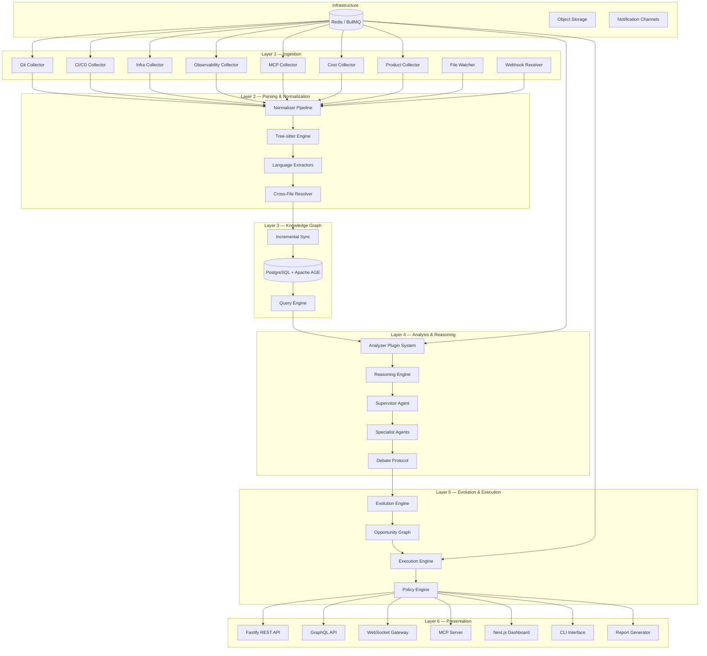
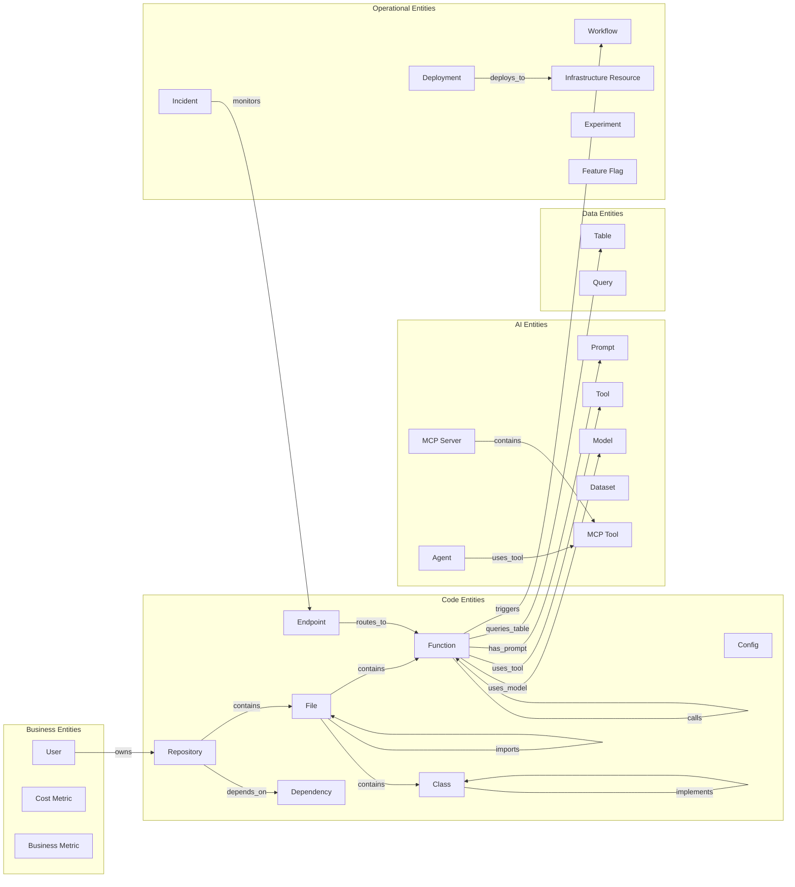
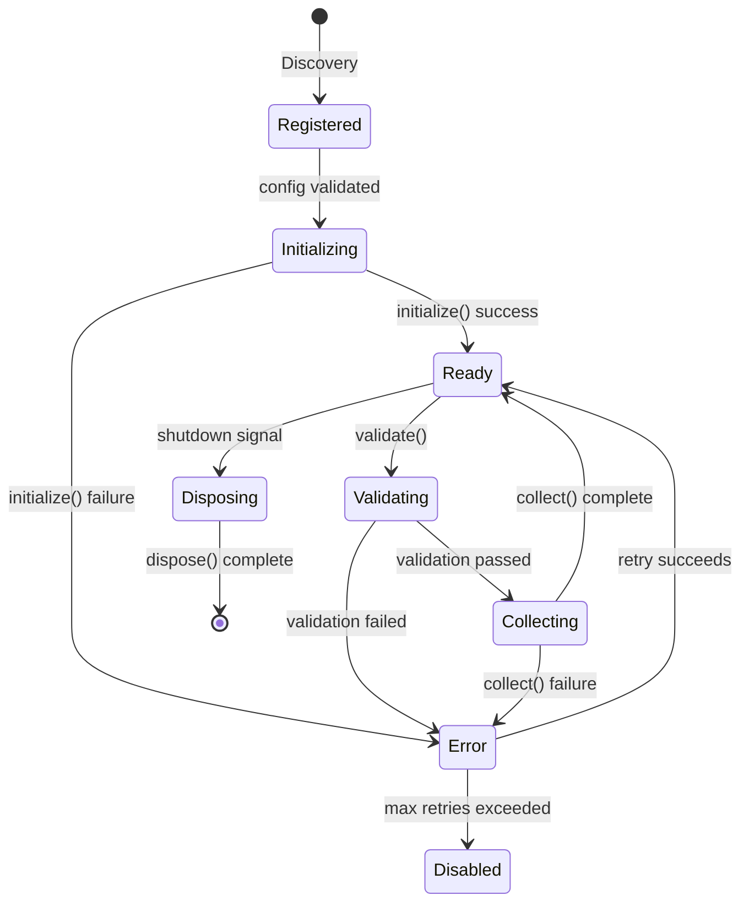
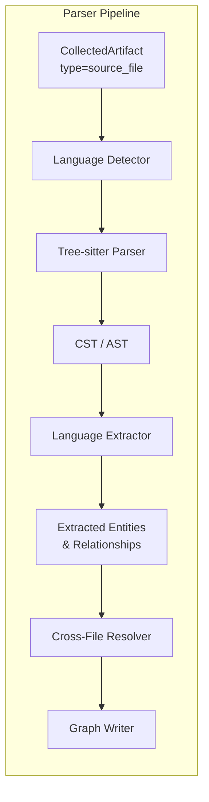
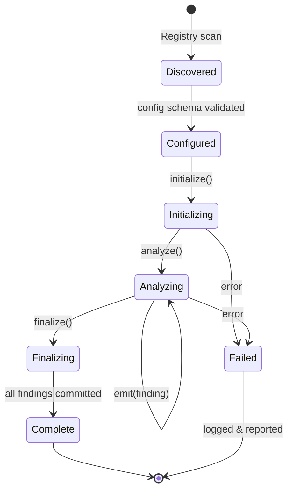
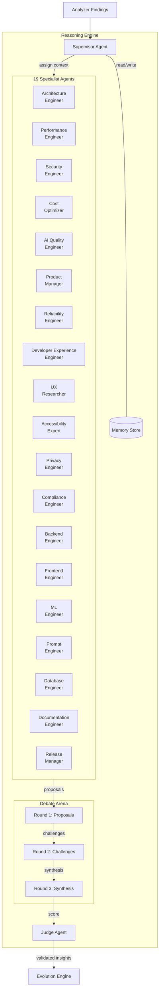
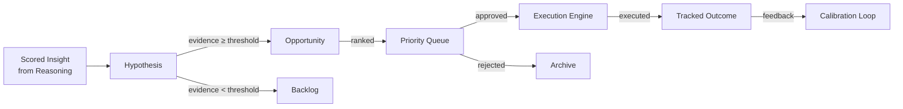
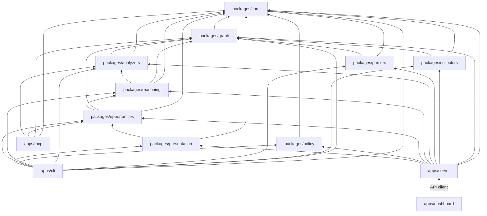
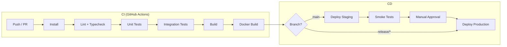
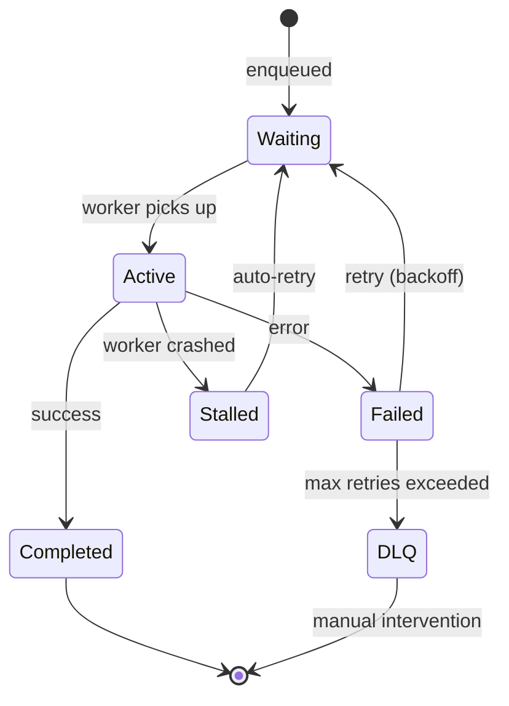

# Recurrsive — Architecture Specification

> **Version**: 1.0.0-draft  
> **Last Updated**: 2026-06-29  
> **Status**: Implementation-Ready  
> **Audience**: Engineers implementing the system

---

## Table of Contents

1. [System Architecture Overview](#1-system-architecture-overview)
2. [The Digital Twin Architecture](#2-the-digital-twin-architecture)
3. [Collector Framework](#3-collector-framework)
4. [Parser Architecture](#4-parser-architecture)
5. [Analyzer Plugin System](#5-analyzer-plugin-system)
6. [Reasoning Engine](#6-reasoning-engine)
7. [Evolution Engine](#7-evolution-engine)
8. [Execution Engine](#8-execution-engine)
9. [Policy Engine](#9-policy-engine)
10. [Presentation Layer](#10-presentation-layer)
11. [Monorepo Package Structure](#11-monorepo-package-structure)
12. [Security Architecture](#12-security-architecture)
13. [Deployment Architecture](#13-deployment-architecture)
14. [Scalability Considerations](#14-scalability-considerations)

---

## 1. System Architecture Overview

### 1.1 High-Level Component Diagram



### 1.2 End-to-End Data Flow

```
Source Systems ─┬─ Git repos (clone/webhook)
                ├─ CI/CD platforms (API poll/webhook)
                ├─ Infrastructure (Terraform, K8s, Docker)
                ├─ Observability (logs, traces, incidents)
                ├─ MCP servers (tool/resource discovery)
                ├─ Cost platforms (billing APIs)
                └─ Product analytics (events, experiments)
                           │
                           ▼
                ┌─────────────────────┐
                │   Collector Layer   │  Normalize into CollectedArtifact
                └─────────┬───────────┘
                          │
                          ▼
                ┌─────────────────────┐
                │   Parser Layer      │  Tree-sitter ASTs → entity extraction
                └─────────┬───────────┘
                          │
                          ▼
                ┌─────────────────────┐
                │   Knowledge Graph   │  Entities + Relationships (Apache AGE)
                └─────────┬───────────┘
                          │
                          ▼
                ┌─────────────────────┐
                │   Analyzer Layer    │  Pattern detection → raw findings
                └─────────┬───────────┘
                          │
                          ▼
                ┌─────────────────────┐
                │  Reasoning Engine   │  Multi-agent debate → validated insights
                └─────────┬───────────┘
                          │
                          ▼
                ┌─────────────────────┐
                │  Evolution Engine   │  Hypotheses → ranked opportunities
                └─────────┬───────────┘
                          │
                          ▼
                ┌─────────────────────┐
                │  Execution Engine   │  PRs, issues, RFCs, experiments
                └─────────┬───────────┘
                          │
                          ▼
                ┌─────────────────────┐
                │  Presentation Layer │  APIs, Dashboard, MCP, CLI, Reports
                └─────────────────────┘
```

### 1.3 Layer-to-Package Mapping

| Layer | Packages | Primary Responsibility |
|-------|----------|----------------------|
| Ingestion | `packages/collectors` | Gather raw data from external systems |
| Parsing & Normalization | `packages/parsers` | Structural code analysis, entity extraction |
| Knowledge Graph | `packages/graph` | Graph storage, queries, incremental sync |
| Analysis & Reasoning | `packages/analyzers`, `packages/reasoning` | Pattern detection, multi-agent evaluation |
| Evolution & Execution | `packages/opportunities`, `packages/policy` | Opportunity ranking, execution, policy gates |
| Presentation | `packages/presentation`, `apps/server`, `apps/dashboard`, `apps/mcp`, `apps/cli` | APIs, UI, MCP, CLI |
| Shared | `packages/core` | Types, schemas, utilities, Zod validators |

---

## 2. The Digital Twin Architecture

The knowledge graph is the central nervous system of Recurrsive. It maintains a **digital twin** of the entire AI-augmented software system — code, infrastructure, data flows, AI components, costs, and organizational structure — as a property graph in PostgreSQL via the Apache AGE extension.

### 2.1 Graph Schema Overview



### 2.2 Entity Type Definitions

Every entity is stored as a vertex in the Apache AGE graph with a label corresponding to its type. All entities share a common base property set.

```typescript
// packages/core/src/schema/entity.ts

interface BaseEntity {
  /** Globally unique, deterministic ID: sha256(entityType + qualifiedName + sourceId) */
  id: string;
  /** Human-readable qualified name (e.g., "myrepo/src/agents/planner.ts::PlannerAgent") */
  qualified_name: string;
  /** ID of the source system that produced this entity */
  source_id: string;
  /** Timestamp of last observation from a collector */
  last_seen_at: string; // ISO 8601
  /** Timestamp of first observation */
  first_seen_at: string;
  /** Arbitrary metadata from the collector/parser */
  metadata: Record<string, unknown>;
  /** SHA-256 hash of canonical content, for change detection */
  content_hash: string;
}
```

| Entity Type | Label | Key Properties (beyond base) |
|---|---|---|
| `repository` | `Repository` | `url`, `default_branch`, `language_breakdown`, `visibility` |
| `file` | `File` | `path`, `language`, `size_bytes`, `line_count` |
| `function` | `Function` | `name`, `signature`, `start_line`, `end_line`, `complexity`, `is_async`, `is_exported` |
| `class` | `Class` | `name`, `is_abstract`, `member_count`, `superclasses` |
| `endpoint` | `Endpoint` | `method`, `path`, `auth_required`, `rate_limited` |
| `prompt` | `Prompt` | `template`, `variables`, `model_target`, `token_estimate`, `version` |
| `agent` | `Agent` | `framework`, `role`, `tools_used`, `model`, `system_prompt_hash` |
| `tool` | `Tool` | `name`, `input_schema`, `output_schema`, `side_effects` |
| `model` | `Model` | `provider`, `model_id`, `version`, `context_window`, `cost_per_1k_input`, `cost_per_1k_output` |
| `dataset` | `Dataset` | `format`, `record_count`, `schema_hash`, `storage_location` |
| `table` | `Table` | `database`, `schema_name`, `column_count`, `row_estimate`, `indexes` |
| `query` | `Query` | `sql_hash`, `tables_referenced`, `estimated_cost`, `frequency` |
| `dependency` | `Dependency` | `name`, `version`, `registry`, `license`, `is_dev`, `vulnerability_count` |
| `config` | `Config` | `key`, `value_hash`, `source_file`, `environment`, `is_secret` |
| `mcp_server` | `MCPServer` | `transport`, `url`, `capabilities`, `tool_count`, `resource_count` |
| `mcp_tool` | `MCPTool` | `name`, `description`, `input_schema`, `server_id` |
| `workflow` | `Workflow` | `platform`, `trigger`, `step_count`, `estimated_duration`, `success_rate` |
| `user` | `User` | `email`, `role`, `team`, `last_active` |
| `incident` | `Incident` | `severity`, `status`, `mttr_seconds`, `root_cause`, `affected_services` |
| `cost_metric` | `CostMetric` | `provider`, `service`, `amount_usd`, `period`, `unit` |
| `business_metric` | `BusinessMetric` | `name`, `value`, `unit`, `trend`, `period` |
| `infrastructure_resource` | `InfrastructureResource` | `provider`, `resource_type`, `region`, `cost_monthly`, `tags` |
| `deployment` | `Deployment` | `environment`, `version`, `status`, `deployed_at`, `deployer` |
| `experiment` | `Experiment` | `name`, `status`, `variant_count`, `metrics`, `start_date`, `end_date` |
| `feature_flag` | `FeatureFlag` | `name`, `status`, `rollout_percentage`, `targeting_rules` |

### 2.3 Relationship Type Definitions

Relationships are stored as edges in the Apache AGE graph. Every edge carries temporal metadata.

```typescript
// packages/core/src/schema/relationship.ts

interface BaseRelationship {
  /** Deterministic ID: sha256(type + source_id + target_id + qualifier) */
  id: string;
  /** Optional qualifier for disambiguation (e.g., call-site line number) */
  qualifier?: string;
  /** Confidence score from the parser/collector (0.0–1.0) */
  confidence: number;
  /** Collector or parser that created this edge */
  source_system: string;
  first_seen_at: string;
  last_seen_at: string;
  metadata: Record<string, unknown>;
}
```

| Relationship | From → To | Edge Properties |
|---|---|---|
| `contains` | Repository→File, File→Function, File→Class, MCPServer→MCPTool | `depth` |
| `imports` | File→File | `import_path`, `is_dynamic`, `symbols[]` |
| `calls` | Function→Function | `call_site_line`, `is_conditional`, `is_async` |
| `implements` | Class→Class | `interface_name` |
| `extends` | Class→Class | `depth` |
| `uses_model` | Function→Model, Agent→Model | `call_count`, `avg_tokens`, `avg_latency_ms` |
| `uses_tool` | Function→Tool, Agent→Tool, Agent→MCPTool | `invocation_count` |
| `has_prompt` | Function→Prompt, Agent→Prompt | `role` (system/user/assistant) |
| `queries_table` | Function→Table, Query→Table | `operation` (SELECT/INSERT/UPDATE/DELETE) |
| `depends_on` | Repository→Dependency, File→Dependency | `version_constraint`, `is_dev` |
| `deploys_to` | Deployment→InfrastructureResource | `strategy` (rolling/blue-green/canary) |
| `routes_to` | Endpoint→Function | `middleware[]` |
| `caches` | Function→Function, Endpoint→Endpoint | `ttl_seconds`, `strategy` |
| `triggers` | Function→Workflow, Workflow→Workflow | `event`, `condition` |
| `evaluates` | Experiment→BusinessMetric | `variant`, `metric_delta` |
| `monitors` | Incident→Endpoint, Incident→InfrastructureResource | `alert_rule` |
| `owns` | User→Repository, User→Workflow | `role` (owner/maintainer/contributor) |
| `produces` | Function→Dataset, Workflow→Dataset | `format`, `frequency` |
| `consumes` | Function→Dataset, Agent→Dataset | `format`, `frequency` |

### 2.4 Graph Schema DDL (Cypher for Apache AGE)

```sql
-- Enable the AGE extension
CREATE EXTENSION IF NOT EXISTS age;
LOAD 'age';
SET search_path = ag_catalog, "$user", public;

-- Create the graph namespace
SELECT create_graph('recurrsive');

-- ─────────────────────────────────────────────────────────
-- Vertex Labels (Entity Types)
-- ─────────────────────────────────────────────────────────
SELECT create_vlabel('recurrsive', 'Repository');
SELECT create_vlabel('recurrsive', 'File');
SELECT create_vlabel('recurrsive', 'Function');
SELECT create_vlabel('recurrsive', 'Class');
SELECT create_vlabel('recurrsive', 'Endpoint');
SELECT create_vlabel('recurrsive', 'Prompt');
SELECT create_vlabel('recurrsive', 'Agent');
SELECT create_vlabel('recurrsive', 'Tool');
SELECT create_vlabel('recurrsive', 'Model');
SELECT create_vlabel('recurrsive', 'Dataset');
SELECT create_vlabel('recurrsive', 'Table');
SELECT create_vlabel('recurrsive', 'Query');
SELECT create_vlabel('recurrsive', 'Dependency');
SELECT create_vlabel('recurrsive', 'Config');
SELECT create_vlabel('recurrsive', 'MCPServer');
SELECT create_vlabel('recurrsive', 'MCPTool');
SELECT create_vlabel('recurrsive', 'Workflow');
SELECT create_vlabel('recurrsive', 'UserEntity');
SELECT create_vlabel('recurrsive', 'Incident');
SELECT create_vlabel('recurrsive', 'CostMetric');
SELECT create_vlabel('recurrsive', 'BusinessMetric');
SELECT create_vlabel('recurrsive', 'InfrastructureResource');
SELECT create_vlabel('recurrsive', 'Deployment');
SELECT create_vlabel('recurrsive', 'Experiment');
SELECT create_vlabel('recurrsive', 'FeatureFlag');

-- ─────────────────────────────────────────────────────────
-- Edge Labels (Relationship Types)
-- ─────────────────────────────────────────────────────────
SELECT create_elabel('recurrsive', 'contains');
SELECT create_elabel('recurrsive', 'imports');
SELECT create_elabel('recurrsive', 'calls');
SELECT create_elabel('recurrsive', 'implements');
SELECT create_elabel('recurrsive', 'extends');
SELECT create_elabel('recurrsive', 'uses_model');
SELECT create_elabel('recurrsive', 'uses_tool');
SELECT create_elabel('recurrsive', 'has_prompt');
SELECT create_elabel('recurrsive', 'queries_table');
SELECT create_elabel('recurrsive', 'depends_on');
SELECT create_elabel('recurrsive', 'deploys_to');
SELECT create_elabel('recurrsive', 'routes_to');
SELECT create_elabel('recurrsive', 'caches');
SELECT create_elabel('recurrsive', 'triggers');
SELECT create_elabel('recurrsive', 'evaluates');
SELECT create_elabel('recurrsive', 'monitors');
SELECT create_elabel('recurrsive', 'owns');
SELECT create_elabel('recurrsive', 'produces');
SELECT create_elabel('recurrsive', 'consumes');

-- ─────────────────────────────────────────────────────────
-- Indexes (on vertex properties for fast lookups)
-- ─────────────────────────────────────────────────────────
-- Apache AGE uses GIN indexes on the properties jsonb column.
-- The underlying table for each vertex label is: recurrsive."<LabelName>"
-- Example index creation for frequently queried properties:
CREATE INDEX idx_file_path ON recurrsive."File" USING GIN (properties);
CREATE INDEX idx_function_name ON recurrsive."Function" USING GIN (properties);
CREATE INDEX idx_repository_url ON recurrsive."Repository" USING GIN (properties);
CREATE INDEX idx_model_provider ON recurrsive."Model" USING GIN (properties);
CREATE INDEX idx_prompt_hash ON recurrsive."Prompt" USING GIN (properties);
```

### 2.5 Query Pattern Examples

```sql
-- 1. Find all functions that call a specific LLM model
SELECT * FROM cypher('recurrsive', $$
  MATCH (f:Function)-[r:uses_model]->(m:Model {provider: 'openai', model_id: 'gpt-4o'})
  RETURN f.qualified_name, r.call_count, r.avg_tokens
  ORDER BY r.call_count DESC
$$) AS (func_name agtype, call_count agtype, avg_tokens agtype);

-- 2. Trace the full call chain from an endpoint to all downstream model calls
SELECT * FROM cypher('recurrsive', $$
  MATCH path = (e:Endpoint)-[:routes_to]->(:Function)-[:calls*1..10]->
                (f:Function)-[:uses_model]->(m:Model)
  RETURN e.path, e.method, f.qualified_name, m.model_id, length(path) AS depth
$$) AS (endpoint agtype, method agtype, func agtype, model agtype, depth agtype);

-- 3. Find dead code — functions that are never called and not exported
SELECT * FROM cypher('recurrsive', $$
  MATCH (f:Function)
  WHERE NOT exists((f)<-[:calls]-()) AND f.is_exported = false
  RETURN f.qualified_name, f.start_line, f.end_line
$$) AS (func_name agtype, start_line agtype, end_line agtype);

-- 4. Calculate total estimated monthly cost for all model usage
SELECT * FROM cypher('recurrsive', $$
  MATCH (f:Function)-[r:uses_model]->(m:Model)
  WITH m.model_id AS model, 
       sum(r.call_count * r.avg_tokens) AS total_tokens,
       m.cost_per_1k_input AS cost_rate
  RETURN model, total_tokens, (total_tokens / 1000.0) * cost_rate AS estimated_cost
  ORDER BY estimated_cost DESC
$$) AS (model agtype, tokens agtype, cost agtype);

-- 5. Detect circular dependencies between files
SELECT * FROM cypher('recurrsive', $$
  MATCH path = (a:File)-[:imports*2..8]->(a)
  RETURN [n IN nodes(path) | n.path] AS cycle
  LIMIT 20
$$) AS (cycle agtype);

-- 6. Find MCP tools not used by any agent or function
SELECT * FROM cypher('recurrsive', $$
  MATCH (t:MCPTool)
  WHERE NOT exists(()-[:uses_tool]->(t))
  RETURN t.name, t.server_id
$$) AS (tool_name agtype, server agtype);
```

### 2.6 Incremental Sync Strategy

The graph uses a **content-hash + last_seen_at** strategy for incremental updates:

```
┌────────────────────────────────┐
│   Collector / Parser Emits     │
│   Entity or Relationship       │
└──────────────┬─────────────────┘
               │
               ▼
       ┌───────────────┐
       │ Compute ID    │  sha256(type + qualifiedName + sourceId)
       │ Compute Hash  │  sha256(canonical content)
       └───────┬───────┘
               │
        ┌──────┴──────┐
        │ Exists in   │
        │ graph?      │
        └──┬──────┬───┘
       Yes │      │ No
           │      │
    ┌──────┴──┐   └──────┐
    │ Hash    │          │
    │ changed?│    ┌─────┴──────┐
    └──┬───┬──┘    │ INSERT new │
   Yes │   │ No    │ vertex/edge│
       │   │       └────────────┘
  ┌────┴─┐ └──────────┐
  │UPDATE│  │ Touch     │
  │props │  │ last_seen │
  └──────┘  └───────────┘
```

**Garbage collection**: Entities not seen after `N` sync cycles (configurable, default 3) are marked `stale`. After `M` additional cycles they are soft-deleted (property `_deleted: true`). Hard deletes are a separate scheduled job.

---

## 3. Collector Framework

### 3.1 Collector Interface

```typescript
// packages/core/src/interfaces/collector.ts

import { z } from 'zod';

/** The artifact emitted by a collector after normalization. */
export interface CollectedArtifact {
  /** Collector-assigned artifact type */
  artifactType: string;
  /** Unique identifier within the source system */
  sourceId: string;
  /** ISO 8601 timestamp of collection */
  collectedAt: string;
  /** Raw or lightly-transformed payload */
  payload: unknown;
  /** Content hash for deduplication */
  contentHash: string;
  /** Provenance metadata */
  provenance: {
    collectorId: string;
    collectorVersion: string;
    sourceSystem: string;
    sourceUrl?: string;
  };
}

export interface CollectorConfig {
  /** Unique collector identifier */
  id: string;
  /** Semantic version */
  version: string;
  /** Schedule configuration */
  schedule: ScheduleConfig;
  /** Collector-specific options (validated by Zod schema) */
  options: Record<string, unknown>;
  /** Credential references (resolved at runtime) */
  credentials: CredentialRef[];
}

export interface ScheduleConfig {
  mode: 'one-shot' | 'periodic' | 'webhook' | 'file-watcher';
  /** Cron expression for periodic mode */
  cronExpression?: string;
  /** Webhook path for webhook mode */
  webhookPath?: string;
  /** Glob patterns for file-watcher mode */
  watchPatterns?: string[];
  /** Debounce interval in ms for file-watcher mode */
  debounceMs?: number;
}

export interface CredentialRef {
  key: string;
  source: 'env' | 'vault' | 'config' | 'keyring';
  path: string;
}

/**
 * The Collector interface that all collectors must implement.
 *
 * Lifecycle:
 * 1. `initialize` — configure credentials, validate connectivity.
 * 2. `validate` — verify the collector can reach its data source.
 * 3. `collect` — perform the actual data collection.
 * 4. `dispose` — release resources.
 */
export interface Collector {
  /** Unique identifier (e.g. `'code.typescript'`). */
  id: string;
  /** Human-readable name. */
  name: string;
  /** One-line description. */
  description: string;
  /** Domain this collector operates in. */
  type: CollectorType;
  /** SemVer version string. */
  version: string;

  /** Initialize the collector with its configuration. */
  initialize(config: CollectorConfig): Promise<void>;

  /** Perform the data collection. */
  collect(): Promise<CollectorResult>;

  /** Validate connectivity and configuration. */
  validate(): Promise<{ valid: boolean; errors: string[] }>;

  /** Release any held resources (connections, file handles, etc.). */
  dispose(): Promise<void>;
}
```

### 3.2 Collector Lifecycle



### 3.3 Collector Registry and Discovery

Collectors are registered via a `CollectorRegistry` singleton:

- **File-based discovery**: Scan `packages/collectors/src/builtins/` at startup for classes implementing `Collector`.
- **Plugin discovery**: Scan `node_modules` for packages with `"recurrsive-collector"` in `package.json` `keywords`.
- **Runtime registration**: `registry.register(collectorInstance)` for dynamic/test scenarios.

### 3.4 Scheduling

| Mode | Mechanism | Implementation |
|------|-----------|---------------|
| `one-shot` | Immediate execution via BullMQ job | `collectorQueue.add(collectorId, {}, { attempts: 3 })` |
| `periodic` | BullMQ repeatable job | `collectorQueue.add(collectorId, {}, { repeat: { pattern: cronExpression } })` |
| `webhook` | Fastify route → BullMQ job | Registers `POST /webhooks/collectors/:collectorId` |
| `file-watcher` | chokidar → debounced BullMQ job | Watches configured glob patterns with debounce |

> **Note**: BullMQ integration is planned for Phase 2. The current implementation uses direct async execution.

### 3.5 Error Handling and Retry

- **Retry policy**: Exponential backoff with jitter. Default: 3 attempts, base delay 1s, max delay 30s.
- **Dead letter queue**: After max retries, the job moves to a DLQ (`collector:dlq`). Operators are alerted.
- **Partial success**: Collectors may yield artifacts before failing. Successfully-yielded artifacts are committed; the failure is recorded separately.
- **Circuit breaker**: If a collector fails 5 consecutive times, it enters `Disabled` state and requires manual re-enable or a configurable cool-down period.

### 3.6 Credential Management (BYOC — Bring Your Own Credentials)

Recurrsive **never stores credentials in its own database**. Credentials are resolved at runtime from:

| Source | Resolution Strategy |
|--------|-------------------|
| `env` | `process.env[path]` |
| `vault` | HashiCorp Vault client (KV v2 API) |
| `config` | Encrypted field in collector config file (AES-256-GCM, key from env) |
| `keyring` | OS keyring via `keytar` (local dev only) |

### 3.7 Data Governance Hooks

Every `CollectedArtifact` passes through a governance pipeline before entering the graph:

1. **Masking**: Configurable regex rules strip secrets, PII, or sensitive tokens from payloads.
2. **Filtering**: Exclude files/paths matching user-defined glob patterns (e.g., `**/node_modules/**`).
3. **Audit**: Every collection event is logged to the `audit_log` table with collector ID, timestamp, artifact count, and content hashes.

---

## 4. Parser Architecture

### 4.1 Tree-sitter Integration



The parser uses `tree-sitter` via the `web-tree-sitter` WASM bindings for portability. Language grammars are loaded dynamically from `tree-sitter-{language}` packages.

**Supported languages at launch**: TypeScript, JavaScript, Python, Go, Rust, Java, SQL, HCL (Terraform), YAML, JSON, TOML.

### 4.2 Language Extractor Interface

```typescript
// packages/parsers/src/interfaces/extractor.ts

import type { Tree, SyntaxNode } from 'web-tree-sitter';

export interface ExtractionResult {
  entities: ExtractedEntity[];
  relationships: ExtractedRelationship[];
  /** Unresolved references to be resolved in cross-file pass */
  unresolvedRefs: UnresolvedReference[];
}

export interface ExtractedEntity {
  type: string;          // maps to graph vertex label
  qualifiedName: string;
  properties: Record<string, unknown>;
  location: SourceLocation;
}

export interface ExtractedRelationship {
  type: string;          // maps to graph edge label
  sourceQualifiedName: string;
  targetQualifiedName: string;
  properties: Record<string, unknown>;
  location: SourceLocation;
}

export interface UnresolvedReference {
  fromQualifiedName: string;
  toSymbol: string;       // unresolved symbol name
  importPath?: string;    // the import specifier, if available
  kind: 'call' | 'import' | 'type_reference' | 'instantiation';
  location: SourceLocation;
}

export interface SourceLocation {
  file: string;
  startLine: number;
  startColumn: number;
  endLine: number;
  endColumn: number;
}

/**
 * A LanguageExtractor is responsible for extracting entities and relationships
 * from a single file's AST for a given programming language.
 */
export interface LanguageExtractor {
  /** Language IDs this extractor handles (e.g., ['typescript', 'tsx']) */
  readonly languages: string[];

  /** Extract entities and relationships from the AST */
  extract(tree: Tree, filePath: string, fileContent: string): ExtractionResult;

  /** Return the Tree-sitter grammar package name */
  getGrammarPackage(): string;
}
```

### 4.3 AI-Specific Pattern Detection

Each `LanguageExtractor` includes specialized detectors for AI-related patterns. These are implemented as composable **pattern matchers** invoked during extraction.

| Pattern Category | Detection Strategy | Emitted Entities/Edges |
|---|---|---|
| **LLM API Calls** | Match calls to `openai.chat.completions.create`, `anthropic.messages.create`, `google.generativeai`, etc. | `Function -[uses_model]-> Model` |
| **Prompt Templates** | Detect string literals/template literals passed to LLM calls; match `SystemMessage()`, `HumanMessage()` | `Prompt` entity, `Function -[has_prompt]-> Prompt` |
| **Agent Definitions** | Match class/function patterns for LangChain agents, AutoGen, CrewAI, custom `Agent` classes | `Agent` entity |
| **Tool Definitions** | Match `@tool` decorators, `tool()` wrappers, function schemas passed to LLM APIs | `Tool` entity |
| **RAG Pipelines** | Detect vector store imports (Pinecone, Chroma, Weaviate), embedding calls, retrieval chains | `Function -[queries_table]-> Table` (vector store as table) |
| **MCP Usage** | Match `@modelcontextprotocol/sdk` imports, `server.tool()`, `server.resource()`, `client.callTool()` | `MCPServer`, `MCPTool` entities |
| **Model Config** | Extract model names, temperatures, max_tokens from API call arguments | Properties on `uses_model` edge |

### 4.4 Cross-File Reference Resolution

After all files in a repository are individually parsed, a **cross-file resolution pass** resolves `UnresolvedReference` entries:

1. **Build symbol table**: Aggregate all exported symbols across files into a `Map<importPath, Map<symbolName, qualifiedName>>`.
2. **Resolve imports**: For each `UnresolvedReference`, look up the `importPath` in the symbol table. If found, emit the corresponding relationship.
3. **Heuristic resolution**: For unresolved bare names (no import path), search the symbol table by name. If exactly one match, resolve it. If ambiguous, mark as `confidence: 0.5` and flag for human review.
4. **External resolution**: References to `node_modules` packages are resolved to `Dependency` entities, not individual functions.

### 4.5 Incremental Parsing Strategy

- **File hash check**: Before parsing, compare the file's `content_hash` to the stored hash in the graph. Skip unchanged files.
- **Dependency invalidation**: If file `A` changes and file `B` imports from `A`, re-run cross-file resolution for `B` (but don't re-parse `B`'s AST unless `B` also changed).
- **Batch processing**: Files are parsed in parallel up to a configurable concurrency limit (default: `os.cpus().length`).
- **Dirty tracking**: A `dirty_files` set tracks files needing re-resolution. After parsing, the resolver processes only dirty files.

---

## 5. Analyzer Plugin System

### 5.1 Analyzer Interface

```typescript
// packages/core/src/interfaces/analyzer.ts

import { z } from 'zod';

export interface Finding {
  /** Unique finding ID (deterministic: sha256(analyzerId + type + location)) */
  id: string;
  /** Analyzer that produced this finding */
  analyzerId: string;
  /** Finding category */
  category: string;
  /** Severity: info | low | medium | high | critical */
  severity: 'info' | 'low' | 'medium' | 'high' | 'critical';
  /** Human-readable title */
  title: string;
  /** Detailed description with evidence */
  description: string;
  /** Affected entities (qualified names) */
  affectedEntities: string[];
  /** Location(s) in source code, if applicable */
  locations: SourceLocation[];
  /** Structured evidence supporting this finding */
  evidence: Record<string, unknown>;
  /** Suggested remediation */
  remediation?: string;
  /** Confidence score (0.0–1.0) */
  confidence: number;
  /** Estimated effort to address (hours) */
  estimatedEffort?: number;
  /** Tags for filtering */
  tags: string[];
  /** ISO 8601 timestamp */
  detectedAt: string;
}

export interface AnalysisContext {
  /** Read-only knowledge graph client. */
  graph: GraphClient;
  /** Analyzer-specific configuration. */
  config: AnalyzerConfig;
  /** Historical analysis data. */
  history: AnalysisHistory;
  /** Project-level metadata. */
  project: ProjectInfo;
  /** Emit a finding from within the analysis lifecycle. */
  emit: (finding: Finding) => void;
}

export interface Analyzer {
  /** Unique identifier (e.g. `'security.dependency-audit'`). */
  id: string;
  /** Human-readable name. */
  name: string;
  /** One-line description of what this analyzer checks. */
  description: string;
  /** SemVer version string. */
  version: string;
  /** Categories this analyzer can produce findings for. */
  categories: OpportunityCategory[];

  /** One-time initialization hook. */
  initialize(ctx: AnalysisContext): Promise<void>;

  /** Main analysis pass. Returns findings discovered during this pass. */
  analyze(ctx: AnalysisContext): Promise<Finding[]>;

  /** Finalization hook for summary-level findings. */
  finalize(ctx: AnalysisContext): Promise<Finding[]>;
}
```

### 5.2 Analyzer Lifecycle



### 5.3 Registry and Discovery

| Discovery Mechanism | How It Works |
|---|---|
| **File-based** | Scan `packages/analyzers/src/builtins/` for modules exporting an `Analyzer` |
| **npm-based** | Scan `node_modules` for packages with `recurrsive-analyzer` keyword in `package.json` |
| **Config-based** | `recurrsive.config.ts` specifies analyzer IDs and per-analyzer config overrides |
| **Runtime** | `registry.register(analyzerInstance)` for programmatic use |

### 5.4 Configuration Schema Per Analyzer

Each analyzer declares its own Zod schema. Global config is merged with per-analyzer overrides:

```typescript
// Example: cost analyzer config
const CostAnalyzerConfigSchema = z.object({
  monthlyBudgetUsd: z.number().default(1000),
  alertThresholdPercent: z.number().min(0).max(100).default(80),
  ignoredModels: z.array(z.string()).default([]),
  costAllocationTags: z.array(z.string()).default([]),
});
```

### 5.5 Built-in Analyzers

| ID | Category | What It Detects |
|---|---|---|
| `architecture.structural` | Architecture | Circular dependencies, god modules, coupling, cohesion, layering violations |
| `ai.quality` | AI | Prompt injection risks, missing guardrails, version drift, output quality |
| `performance.general` | Performance | Hot paths, N+1 queries, missing caching, synchronous blocking |
| `cost.optimization` | Cost | Over-provisioned infra, expensive model calls, idle resources |
| `reliability.resilience` | Reliability | Missing error handling, single points of failure, no retries, no circuit breakers |
| `security.vulnerabilities` | Security | Dependency vulnerabilities, exposed secrets, injection surfaces, RBAC gaps |
| `data.schema-quality` | Data | Schema drift, missing validations, unindexed queries, orphaned tables |
| `docs.completeness` | Documentation | Undocumented exports, stale README, missing API docs, changelog gaps |
| `ux.quality` | UX | Inconsistent API patterns, missing docs, breaking changes, pagination issues |
| `product.health` | Product | Stale feature flags, experiment conclusions, unused features |

---

## 6. Reasoning Engine

The reasoning engine transforms raw analyzer findings into validated, contextualized insights through a multi-agent debate architecture.

### 6.1 Supervisor Agent Architecture



### 6.2 Supervisor Agent

The Supervisor is a state-machine-based orchestrator (LangGraph-style, but framework-agnostic):

```typescript
// packages/reasoning/src/supervisor.ts

interface SupervisorState {
  /** Current phase of reasoning */
  phase: 'triage' | 'assign' | 'debate' | 'judge' | 'complete';
  /** Findings grouped by theme/cluster */
  findingClusters: FindingCluster[];
  /** Specialist assignments: which agents handle which clusters */
  assignments: Map<string, string[]>;
  /** Debate rounds */
  rounds: DebateRound[];
  /** Final scored insights */
  insights: ScoredInsight[];
  /** Iteration counter to prevent infinite loops */
  iteration: number;
  maxIterations: number;
}

type SupervisorTransition =
  | { from: 'triage';  to: 'assign';  action: 'cluster_findings' }
  | { from: 'assign';  to: 'debate';  action: 'assign_specialists' }
  | { from: 'debate';  to: 'judge';   action: 'run_debate_protocol' }
  | { from: 'debate';  to: 'debate';  action: 'additional_round' }
  | { from: 'judge';   to: 'complete'; action: 'score_and_rank' };
```

**Triage phase**: The Supervisor clusters related findings using semantic similarity (embedding-based) and graph proximity (findings that share affected entities within 2 hops). This prevents the same issue from being debated multiple times from different angles.

### 6.3 Specialist Agent Definitions

Each specialist agent is a prompted LLM invocation with a cognitive framework:

| Specialist | Cognitive Framework | Focus |
|---|---|---|
| Architecture Engineer | Coupling, cohesion, dependency graphs, fitness functions | Structural integrity, modularity, layering, evolution paths |
| Performance Engineer | **USE Method** — Utilization, Saturation, Errors; Amdahl's Law | Latency, throughput, resource efficiency, bottleneck identification |
| Security Engineer | **STRIDE/DREAD** — Threat modeling, defense-in-depth | Attack surfaces, vulnerability prioritization, compliance gaps |
| Cost Optimizer | ROI, TCO, compound interest of tech debt | Unit economics, waste elimination, right-sizing, reservation strategy |
| AI Quality Engineer | Prompt robustness, output quality, hallucination detection | Prompt design, model evaluation, regression testing, safety |
| Product Manager | **RICE** — Reach, Impact, Confidence, Effort | Feature value, user impact, adoption risk, strategic alignment |
| Reliability Engineer | FMEA, SLO-based reasoning, error budgets | SLOs, failure modes, redundancy, chaos engineering |
| Developer Experience Engineer | Cognitive load analysis, dev loop optimization | Build times, onboarding, API ergonomics, toolchain |
| UX Researcher | Usability heuristics, user journey analysis | Interaction patterns, information architecture, cognitive load |
| Accessibility Expert | **WCAG 2.2** guidelines, assistive tech testing | Keyboard navigation, screen readers, color contrast, touch targets |
| Privacy Engineer | Data flow analysis, consent management | GDPR/CCPA, data minimization, pseudonymization, subject rights |
| Compliance Engineer | Control framework mapping, audit trail verification | SOC 2, ISO 27001, HIPAA, change management, incident response |
| Backend Engineer | Request lifecycle tracing, data integrity analysis | API design, query efficiency, concurrency, error handling |
| Frontend Engineer | Component tree audit, rendering analysis | Core Web Vitals, state management, bundle optimization, a11y |
| ML Engineer | Data lineage, experiment reproducibility | Data pipelines, model serving, drift detection, MLOps |
| Prompt Engineer | Prompt structure audit, reliability measurement | Template management, output validation, cost optimization |
| Database Engineer | Schema fitness, query plan analysis | Indexing, constraints, transactions, migrations, partitioning |
| Documentation Engineer | Coverage audit, accuracy testing, freshness checks | API docs, onboarding, changelog, discoverability |
| Release Manager | Readiness assessment, change risk scoring | Deployment strategies, rollback, CI/CD, version management |

### 6.4 Debate Protocol

```
Round 1 — PROPOSALS (parallel)
  Each assigned specialist independently analyzes their clusters.
  Output: A structured Proposal per cluster with:
    - Diagnosis (root cause analysis)
    - Impact assessment (quantified where possible)
    - Recommended action
    - Confidence level
    - Evidence citations (graph node references)

Round 2 — CHALLENGES (round-robin)
  Each specialist reviews proposals from other specialists.
  Output: Challenge objects containing:
    - Agreement/disagreement with supporting reasoning
    - Alternative interpretations
    - Questions that would change the recommendation
    - Blind spot identification (what the proposer may have missed)

Round 3 — SYNTHESIS (collaborative)
  Specialists revise their proposals incorporating challenges.
  Output: Refined proposals with:
    - Updated confidence (may go up or down)
    - Incorporated counter-arguments
    - Explicit uncertainty markers
    - Cross-domain dependencies identified
```

### 6.5 Judge Scoring Rubric

The Judge agent (a separate LLM invocation with a meta-cognitive prompt) scores each synthesized insight:

| Criterion | Weight | Description | Scale |
|---|---|---|---|
| Evidence Strength | 0.30 | How well is the insight supported by graph data and findings? | 1–5 |
| Confidence | 0.20 | Combined confidence after debate (agreement strengthens, disagreement weakens) | 1–5 |
| Impact | 0.25 | Estimated impact on system quality, cost, risk, or velocity | 1–5 |
| Effort | 0.15 | Inverse of implementation effort — easy wins score higher | 1–5 |
| Novelty | 0.10 | Is this a known issue being restated, or a genuinely new insight? | 1–5 |

**Score formula**: `weighted_sum = Σ(criterion_score × weight)` → normalized to 0–100.

Insights scoring below a configurable threshold (default: 40) are discarded. Insights 40–60 are flagged for human review. Insights above 60 proceed to the Evolution Engine.

### 6.6 LLM Abstraction Layer

```typescript
// packages/core/src/interfaces/llm.ts

export interface LLMProvider {
  readonly providerId: string;
  
  /** Send a chat completion request */
  chat(request: ChatRequest): Promise<ChatResponse>;
  
  /** Generate embeddings */
  embed(texts: string[], model?: string): Promise<number[][]>;
  
  /** Check if a model is available */
  isModelAvailable(modelId: string): Promise<boolean>;
  
  /** Get cost estimate for a request */
  estimateCost(request: ChatRequest): CostEstimate;
}

export interface ChatRequest {
  model: string;
  messages: Message[];
  temperature?: number;
  maxTokens?: number;
  responseFormat?: 'text' | 'json';
  /** Zod schema for structured output (converted to JSON Schema for the provider) */
  structuredOutput?: z.ZodType;
  /** Abort signal */
  signal?: AbortSignal;
}

export interface ChatResponse {
  content: string;
  /** Parsed structured output, if structuredOutput was provided */
  parsed?: unknown;
  usage: { inputTokens: number; outputTokens: number };
  model: string;
  latencyMs: number;
  finishReason: 'stop' | 'length' | 'tool_use' | 'error';
}
```

**Supported providers** (via adapter pattern): OpenAI, Anthropic, Google Gemini, Ollama (local), Azure OpenAI. Each adapter normalizes the wire protocol into the common `LLMProvider` interface.

### 6.7 Memory and Learning Persistence

The reasoning engine persists learned patterns to PostgreSQL (relational, not graph):

| Table | Purpose |
|---|---|
| `reasoning_sessions` | Full session log: state transitions, LLM calls, timing |
| `insight_history` | All scored insights with embeddings for similarity search |
| `calibration_data` | When users accept/reject insights, store outcome for calibration |
| `specialist_performance` | Track which specialists produce high-scoring insights per domain |

### 6.8 Error Recovery and Hallucination Detection

- **LLM timeout**: 60s per call. On timeout, retry once with a shorter max_tokens. On second failure, the specialist's proposal is marked `incomplete` and the debate proceeds without it.
- **Structured output validation**: All LLM responses are validated against Zod schemas. Parse failures trigger a retry with an appended "Your previous response did not match the required schema" message.
- **Hallucination detection**: Every entity reference (qualified name) in an insight is verified against the graph. If ≥20% of cited entities don't exist, the insight is flagged as `hallucinated` and discarded.
- **Loop detection**: The Supervisor enforces a `maxIterations` (default: 5) on the debate state machine. If the debate does not converge, it is terminated and the best-scored proposal at that point is used.

---

## 7. Evolution Engine

The Evolution Engine transforms validated insights into actionable, prioritized opportunities and tracks them through their lifecycle.

### 7.1 Hypothesis → Opportunity Pipeline



```typescript
// packages/opportunities/src/types.ts

export interface Hypothesis {
  id: string;
  /** Source insight ID */
  insightId: string;
  /** What we believe is true */
  thesis: string;
  /** What evidence supports this */
  supportingEvidence: EvidenceItem[];
  /** What would need to be true for this to matter */
  assumptions: string[];
  /** How we could validate this */
  validationStrategy: string;
  /** Confidence from the reasoning engine (0–100) */
  confidence: number;
  createdAt: string;
}

export interface Opportunity {
  id: string;
  hypothesisId: string;
  /** Short, actionable title */
  title: string;
  /** Detailed description */
  description: string;
  /** Impact dimensions */
  impact: {
    quality: number;       // 0–10
    velocity: number;      // 0–10
    cost: number;          // 0–10 (savings potential)
    risk: number;          // 0–10 (risk reduction)
    innovation: number;    // 0–10
  };
  /** Estimated implementation effort (hours) */
  effortHours: number;
  /** Priority score (computed) */
  priorityScore: number;
  /** Maturity level */
  maturity: 'hypothesis' | 'validated' | 'planned' | 'in_progress' | 'completed' | 'abandoned';
  /** Affected graph entities */
  affectedEntities: string[];
  /** Suggested execution strategy */
  executionStrategy: ExecutionStrategy;
  /** Status history */
  timeline: TimelineEvent[];
}
```

### 7.2 Ranking Algorithm

Opportunities are ranked using a composite score:

```
priorityScore = (
    impact.quality   × w_quality   +
    impact.velocity  × w_velocity  +
    impact.cost      × w_cost      +
    impact.risk      × w_risk      +
    impact.innovation × w_innovation
  ) × confidenceMultiplier / effortPenalty

where:
  confidenceMultiplier = confidence / 100           (0.0–1.0)
  effortPenalty        = log2(effortHours + 1) + 1  (dampens high effort)
  w_*                  = user-configurable weights, default all 1.0
```

**Tie-breaking**: When scores are equal, prefer opportunities that affect more graph entities (broader impact).

### 7.3 Evolution Graph Structure

Opportunities and their relationships are themselves stored in the knowledge graph:

```sql
-- Vertex labels for evolution tracking
SELECT create_vlabel('recurrsive', 'Insight');
SELECT create_vlabel('recurrsive', 'Hypothesis');
SELECT create_vlabel('recurrsive', 'Opportunity');
SELECT create_vlabel('recurrsive', 'Execution');

-- Edge labels for evolution tracking
SELECT create_elabel('recurrsive', 'derives_from');    -- Hypothesis -> Insight
SELECT create_elabel('recurrsive', 'validates');        -- Opportunity -> Hypothesis
SELECT create_elabel('recurrsive', 'affects');          -- Opportunity -> any entity
SELECT create_elabel('recurrsive', 'executed_by');      -- Opportunity -> Execution
SELECT create_elabel('recurrsive', 'supersedes');       -- Opportunity -> Opportunity
SELECT create_elabel('recurrsive', 'depends_on_opp');   -- Opportunity -> Opportunity
```

### 7.4 Maturity Scoring Methodology

Each opportunity progresses through maturity stages with gated criteria:

| Stage | Entry Criteria | Exit Criteria |
|---|---|---|
| `hypothesis` | Insight scored ≥ 40 | Evidence validated against graph queries |
| `validated` | ≥ 2 independent evidence paths | Human approval or auto-approval by policy |
| `planned` | Approved + execution strategy defined | Execution adapter selected + resources allocated |
| `in_progress` | Execution started | PR merged / issue resolved / experiment concluded |
| `completed` | Execution finished | Impact measured against predicted impact |
| `abandoned` | Any stage | Manual rejection or auto-expire after configurable TTL |

### 7.5 Simulation Engine

Before execution, opportunities can be **simulated** to estimate outcomes:

- **Statistical estimation**: Using historical production data (latency percentiles, error rates, cost per request) stored in the graph, project the impact of changes.
- **What-if queries**: "If we replace model X with model Y in function Z, what is the projected cost change?" — answered by traversing the `uses_model` edges and applying cost formulas.
- **Monte Carlo**: For high-uncertainty estimates, run N simulations with randomized confidence intervals and report the P50/P90/P99 expected impact.

---

## 8. Execution Engine

### 8.1 Execution Adapter Interface

```typescript
// packages/opportunities/src/interfaces/execution.ts

export type ExecutionStrategy =
  | { type: 'pull_request'; targetRepo: string; branch: string }
  | { type: 'issue'; targetRepo: string; labels: string[] }
  | { type: 'rfc'; template: string; reviewers: string[] }
  | { type: 'experiment'; variants: ExperimentVariant[] }
  | { type: 'config_change'; targetConfig: string; changes: Record<string, unknown> }
  | { type: 'manual'; instructions: string };

export interface ExecutionAdapter {
  readonly type: ExecutionStrategy['type'];

  /** Validate that execution is possible given current state */
  validate(opportunity: Opportunity): Promise<ValidationResult>;

  /** Execute the opportunity */
  execute(opportunity: Opportunity, context: ExecutionContext): Promise<ExecutionResult>;

  /** Check execution status */
  status(executionId: string): Promise<ExecutionStatus>;

  /** Rollback a completed execution */
  rollback(executionId: string): Promise<RollbackResult>;
}

export interface ExecutionContext {
  /** Approval gate reference */
  approvalId?: string;
  /** Policy evaluation results */
  policyResults: PolicyEvaluationResult[];
  /** Dry run mode — simulate but don't execute */
  dryRun: boolean;
  /** Abort signal */
  signal: AbortSignal;
}

export interface ExecutionResult {
  executionId: string;
  status: 'success' | 'partial' | 'failed';
  /** External references (PR URL, issue URL, etc.) */
  externalRefs: { type: string; url: string }[];
  /** Artifacts produced (diffs, reports, etc.) */
  artifacts: { name: string; contentType: string; path: string }[];
  /** Execution duration in ms */
  durationMs: number;
}
```

### 8.2 Built-in Adapters

| Adapter | What It Does |
|---|---|
| `PullRequestAdapter` | Generates code changes via LLM, creates a branch, opens a PR. Supports GitHub and GitLab. |
| `IssueAdapter` | Creates a well-structured issue with context, evidence, and suggested approach. |
| `RFCAdapter` | Generates an RFC document from the opportunity, routes to reviewers. |
| `ExperimentAdapter` | Sets up A/B experiments via feature flag integration (LaunchDarkly, Unleash, Statsig). |
| `ConfigChangeAdapter` | Applies configuration changes (e.g., model parameters, cache TTLs) through the config management system. |

### 8.3 Approval Gates

Every execution passes through an approval gate:

- **Auto-approve**: For low-risk opportunities (severity ≤ info, effort ≤ 2 hours, all policies pass). Configurable.
- **Single-approve**: One designated approver must confirm.
- **Multi-approve**: N-of-M approvers required (configurable per team/repository).
- **Time-gated**: Auto-approve after T hours if no rejection (configurable).

### 8.4 Rollback Mechanisms

| Execution Type | Rollback Strategy |
|---|---|
| Pull Request | Close PR, delete branch |
| Issue | Close issue with "auto-closed" label |
| Config Change | Revert to previous config version (config is versioned) |
| Experiment | Disable experiment, route all traffic to control |

---

## 9. Policy Engine

### 9.1 Policy Definition Format

```typescript
// packages/policy/src/types.ts

export interface Policy {
  id: string;
  name: string;
  description: string;
  /** When this policy applies */
  scope: PolicyScope;
  /** The evaluation rules */
  rules: PolicyRule[];
  /** What happens when the policy is violated */
  enforcement: 'block' | 'warn' | 'audit';
  /** Policy version for change tracking */
  version: string;
}

export interface PolicyScope {
  /** Apply to specific entity types */
  entityTypes?: string[];
  /** Apply to specific analyzer categories */
  analyzerCategories?: AnalyzerCategory[];
  /** Apply to specific execution types */
  executionTypes?: ExecutionStrategy['type'][];
  /** Apply to specific repositories (glob patterns) */
  repositories?: string[];
}

export interface PolicyRule {
  id: string;
  description: string;
  /** CEL (Common Expression Language) expression that must evaluate to true */
  condition: string;
  /** Message to display when the rule fails */
  failureMessage: string;
  /** Severity of a violation */
  severity: 'low' | 'medium' | 'high' | 'critical';
}
```

### 9.2 Built-in Policies

| Policy ID | Category | Rules |
|---|---|---|
| `license-compliance` | Compliance | Block execution if affected dependencies use disallowed licenses (GPL in proprietary projects) |
| `security-baseline` | Security | Block PRs that introduce known CVEs; require security review for auth changes |
| `cost-guard` | Cost | Warn if estimated monthly cost increase > $100; block if > $1000 |
| `model-governance` | AI | Block use of unapproved model providers; require prompt review for production prompts |
| `change-velocity` | Reliability | Warn if > 5 automated PRs per day to the same repository |
| `data-residency` | Compliance | Block deployments that would move data across region boundaries |

### 9.3 Custom Policy Support

Users define custom policies in `recurrsive.config.ts`:

```typescript
// recurrsive.config.ts (excerpt)
export default defineConfig({
  policies: [
    {
      id: 'custom-no-gpt3',
      name: 'No GPT-3.5 in Production',
      description: 'All production model calls must use GPT-4 or better',
      scope: { entityTypes: ['Model'] },
      rules: [{
        id: 'no-gpt35',
        description: 'Block GPT-3.5 usage',
        condition: '!(entity.model_id.startsWith("gpt-3.5"))',
        failureMessage: 'GPT-3.5 is not approved for production use',
        severity: 'high',
      }],
      enforcement: 'block',
      version: '1.0.0',
    }
  ],
});
```

### 9.4 Gate Evaluation

Policies are evaluated at two gates:

1. **Pre-execution gate**: Before any execution adapter runs, all applicable policies are evaluated. `block` policies prevent execution. `warn` policies log warnings but allow execution.
2. **Continuous gate**: Policies are re-evaluated on every graph sync. New violations on existing entities are surfaced as findings.

---

## 10. Presentation Layer

### 10.1 REST API Design

**Framework**: Fastify with `@fastify/swagger` for OpenAPI spec generation.

**Base URL**: `/api/v1`

| Method | Path | Description |
|---|---|---|
| `GET` | `/repositories` | List monitored repositories |
| `POST` | `/repositories` | Add a repository to monitor |
| `GET` | `/repositories/:id/entities` | List entities in a repository |
| `GET` | `/entities/:id` | Get entity details with neighbors |
| `GET` | `/entities/:id/graph` | Get subgraph around an entity |
| `GET` | `/findings` | List findings (filterable by analyzer, severity, category) |
| `GET` | `/findings/:id` | Get finding details with evidence |
| `GET` | `/insights` | List reasoning insights |
| `GET` | `/opportunities` | List opportunities (filterable, sortable by priority) |
| `GET` | `/opportunities/:id` | Get opportunity details with timeline |
| `POST` | `/opportunities/:id/approve` | Approve an opportunity for execution |
| `POST` | `/opportunities/:id/reject` | Reject an opportunity |
| `GET` | `/executions` | List executions |
| `GET` | `/executions/:id` | Get execution details |
| `POST` | `/executions/:id/rollback` | Rollback an execution |
| `GET` | `/graph/query` | Execute a Cypher query (read-only) |
| `GET` | `/reports/:type` | Generate a report (markdown, HTML, SARIF, PDF) |
| `GET` | `/health` | Health check (database, Redis, collectors) |
| `GET` | `/metrics` | Prometheus metrics endpoint |

### 10.2 GraphQL Schema Overview

**Framework**: `graphql-yoga` or `mercurius` (Fastify plugin).

```graphql
type Query {
  repository(id: ID!): Repository
  repositories(filter: RepositoryFilter, pagination: Pagination): RepositoryConnection!
  entity(id: ID!): Entity
  entities(filter: EntityFilter, pagination: Pagination): EntityConnection!
  subgraph(entityId: ID!, depth: Int = 2, edgeTypes: [String!]): Subgraph!
  findings(filter: FindingFilter, pagination: Pagination): FindingConnection!
  opportunities(filter: OpportunityFilter, sort: OpportunitySort, pagination: Pagination): OpportunityConnection!
  insights(filter: InsightFilter, pagination: Pagination): InsightConnection!
  graphQuery(cypher: String!): JSON!
}

type Mutation {
  addRepository(input: AddRepositoryInput!): Repository!
  approveOpportunity(id: ID!, comment: String): Opportunity!
  rejectOpportunity(id: ID!, reason: String!): Opportunity!
  rollbackExecution(id: ID!): Execution!
  triggerCollection(collectorId: String!): CollectionJob!
  triggerAnalysis(analyzerIds: [String!]): AnalysisJob!
}

type Subscription {
  findingCreated(severity: [Severity!]): Finding!
  opportunityUpdated(id: ID): Opportunity!
  executionStatusChanged(id: ID): Execution!
  collectionCompleted(collectorId: String): CollectionEvent!
  graphUpdated(entityTypes: [String!]): GraphUpdateEvent!
}

type Entity {
  id: ID!
  type: String!
  qualifiedName: String!
  properties: JSON!
  neighbors(edgeType: String, direction: Direction, limit: Int): [EntityEdge!]!
  findings: [Finding!]!
  opportunities: [Opportunity!]!
}

type Subgraph {
  nodes: [Entity!]!
  edges: [Edge!]!
  stats: SubgraphStats!
}
```

### 10.3 WebSocket Events

**Protocol**: Native WebSocket via `@fastify/websocket`.

| Channel | Event | Payload |
|---|---|---|
| `findings` | `finding:created` | `{ finding: Finding }` |
| `findings` | `finding:resolved` | `{ findingId: string, resolution: string }` |
| `opportunities` | `opportunity:created` | `{ opportunity: Opportunity }` |
| `opportunities` | `opportunity:updated` | `{ opportunity: Opportunity }` |
| `executions` | `execution:started` | `{ execution: Execution }` |
| `executions` | `execution:completed` | `{ execution: Execution }` |
| `executions` | `execution:failed` | `{ execution: Execution, error: string }` |
| `graph` | `graph:sync:started` | `{ repositoryId: string }` |
| `graph` | `graph:sync:completed` | `{ repositoryId: string, stats: SyncStats }` |
| `reasoning` | `debate:started` | `{ sessionId: string, clusters: number }` |
| `reasoning` | `debate:round:completed` | `{ sessionId: string, round: number }` |
| `reasoning` | `debate:completed` | `{ sessionId: string, insightCount: number }` |

### 10.4 MCP Server — Tools, Resources, and Prompts

**Package**: `apps/mcp` — implements an MCP server using `@modelcontextprotocol/sdk`.

#### Tools

| Tool Name | Description | Parameters |
|---|---|---|
| `query_graph` | Execute a read-only Cypher query against the knowledge graph | `cypher: string`, `params?: object` |
| `get_entity` | Get full details of an entity by ID or qualified name | `identifier: string` |
| `get_subgraph` | Get a subgraph around an entity | `entityId: string`, `depth?: number`, `edgeTypes?: string[]` |
| `list_findings` | List findings with optional filters | `severity?: string`, `category?: string`, `limit?: number` |
| `list_opportunities` | List ranked opportunities | `status?: string`, `limit?: number` |
| `explain_entity` | Get an AI-generated explanation of an entity and its role in the system | `entityId: string` |
| `trace_dependency` | Trace the dependency chain of a file/function/class | `entityId: string`, `direction: 'upstream' \| 'downstream'`, `depth?: number` |
| `analyze_impact` | Analyze the blast radius of changing a specific entity | `entityId: string` |
| `search_entities` | Full-text search across all entities | `query: string`, `entityType?: string`, `limit?: number` |
| `get_cost_report` | Get a cost breakdown for model usage | `period?: string`, `groupBy?: string` |

#### Resources

| Resource URI | Description |
|---|---|
| `recurrsive://graph/stats` | Current graph statistics (entity counts, edge counts, last sync) |
| `recurrsive://repositories` | List of monitored repositories with status |
| `recurrsive://findings/summary` | Aggregated findings summary by severity and category |
| `recurrsive://opportunities/top` | Top 10 ranked opportunities |
| `recurrsive://system/health` | System health status |

#### Prompts

| Prompt Name | Description | Arguments |
|---|---|---|
| `architecture_review` | Conduct a comprehensive architecture review | `repository: string` |
| `ai_audit` | Audit AI component usage, costs, and risks | `repository: string` |
| `cost_analysis` | Analyze and optimize costs across the system | `period?: string` |
| `security_assessment` | Identify security vulnerabilities and risks | `scope?: string` |
| `impact_analysis` | Analyze the impact of a proposed change | `entityId: string`, `changeDescription: string` |

### 10.5 Dashboard Page Structure

**Framework**: Next.js (App Router).

| Route | Page | Description |
|---|---|---|
| `/` | Dashboard Home | Overview: entity counts, top findings, top opportunities, recent activity |
| `/graph` | Graph Explorer | Interactive graph visualization (force-directed), entity search, filter by type |
| `/graph/:entityId` | Entity Detail | Entity properties, neighbors, findings, history, code location |
| `/repositories` | Repository List | Monitored repositories, sync status, entity counts |
| `/repositories/:id` | Repository Detail | Repository-scoped graph, findings, costs |
| `/findings` | Findings List | Filterable/sortable table of all findings |
| `/findings/:id` | Finding Detail | Evidence, affected entities, remediation |
| `/opportunities` | Opportunity Board | Kanban board grouped by maturity stage |
| `/opportunities/:id` | Opportunity Detail | Full detail, timeline, simulation results |
| `/reasoning` | Reasoning Sessions | Browse debate transcripts, insight history |
| `/costs` | Cost Dashboard | Cost breakdown by model, function, repository, trend charts |
| `/settings` | Settings | Collector config, analyzer config, policies, credentials |

### 10.6 Report Formats

| Format | Use Case | Generator |
|---|---|---|
| Markdown | GitHub PR comments, CLI output | Template engine (Handlebars) |
| HTML | Email reports, standalone viewing | Markdown → HTML pipeline |
| SARIF | IDE integration (VS Code, JetBrains) | SARIF v2.1.0 schema |
| PDF | Executive reports, audits | Puppeteer headless rendering of HTML |
| JSON | Programmatic consumption | Direct serialization |

### 10.7 Notification Channels

| Channel | Integration | Trigger |
|---|---|---|
| Slack | Webhook / Bot API | Critical findings, execution completions, debate insights |
| Email | SMTP / SendGrid | Periodic digest (daily/weekly), policy violations |
| GitHub | Issues / PR comments | Execution results, code-specific findings |
| PagerDuty | Events API v2 | Critical security findings, policy blocks |
| Webhook | HTTP POST | All events (user-configurable) |

---

## 11. Monorepo Package Structure

### 11.1 Complete Package Map

```
recurrsive/
├── package.json              # Workspace root
├── pnpm-workspace.yaml       # pnpm workspace config
├── turbo.json                # Turborepo pipeline config
├── tsconfig.base.json        # Shared TypeScript config
├── .env.example              # Environment variable template
├── docker-compose.yml        # Local dev stack
├── docs/
│   ├── PRD.md
│   ├── ARCHITECTURE.md       # ← This document
│   └── API.md
│
├── packages/
│   ├── core/                 # Shared types, schemas, utilities
│   │   ├── src/
│   │   │   ├── schema/       # Zod schemas for all entities, relationships, configs
│   │   │   ├── interfaces/   # Collector, Analyzer, LLMProvider interfaces
│   │   │   ├── utils/        # Hashing, ID generation, date helpers
│   │   │   ├── errors/       # Typed error hierarchy
│   │   │   └── constants/    # Entity types, relationship types, defaults
│   │   ├── package.json
│   │   └── tsconfig.json
│   │
│   ├── graph/                # Knowledge graph operations
│   │   ├── src/
│   │   │   ├── client.ts     # Apache AGE client wrapper
│   │   │   ├── schema.ts     # DDL execution and migrations
│   │   │   ├── sync.ts       # Incremental sync engine
│   │   │   ├── query.ts      # Query builder and executor
│   │   │   ├── gc.ts         # Garbage collection (stale entity cleanup)
│   │   │   └── migrations/   # SQL migration files
│   │   ├── package.json      # depends on: @recurrsive/core
│   │   └── tsconfig.json
│   │
│   ├── collectors/           # Data collection from external systems
│   │   ├── src/
│   │   │   ├── registry.ts   # Collector registry
│   │   │   ├── scheduler.ts  # BullMQ scheduler integration
│   │   │   ├── governance.ts # Masking, filtering, audit hooks
│   │   │   └── builtins/
│   │   │       ├── git/      # Git repository collector
│   │   │       ├── github/   # GitHub API collector (PRs, issues, actions)
│   │   │       ├── cicd/     # CI/CD collector (GitHub Actions, GitLab CI)
│   │   │       ├── infra/    # Infrastructure collector (Terraform, K8s)
│   │   │       ├── observability/ # Logs, traces, incidents
│   │   │       ├── mcp/      # MCP server discovery collector
│   │   │       ├── cost/     # Cloud billing collector
│   │   │       └── product/  # Analytics, experiments, feature flags
│   │   ├── package.json      # depends on: @recurrsive/core, @recurrsive/graph
│   │   └── tsconfig.json
│   │
│   ├── parsers/              # Code analysis and entity extraction
│   │   ├── src/
│   │   │   ├── engine.ts     # Tree-sitter initialization, grammar loading
│   │   │   ├── resolver.ts   # Cross-file reference resolution
│   │   │   ├── detector.ts   # AI pattern detection coordinator
│   │   │   └── languages/
│   │   │       ├── typescript.ts
│   │   │       ├── python.ts
│   │   │       ├── go.ts
│   │   │       ├── rust.ts
│   │   │       ├── java.ts
│   │   │       ├── sql.ts
│   │   │       ├── hcl.ts    # Terraform
│   │   │       └── config.ts # YAML, JSON, TOML
│   │   ├── package.json      # depends on: @recurrsive/core, @recurrsive/graph
│   │   └── tsconfig.json
│   │
│   ├── analyzers/            # Analysis plugins
│   │   ├── src/
│   │   │   ├── registry.ts   # Analyzer registry
│   │   │   ├── runner.ts     # Parallel analyzer execution engine
│   │   │   ├── context.ts    # AnalysisContext implementation
│   │   │   └── builtins/
│   │   │       ├── architecture/  # arch-complexity, arch-dependencies
│   │   │       ├── ai/           # ai-prompt-quality, ai-model-usage, ai-agent-health, ai-mcp-analysis
│   │   │       ├── performance/  # perf-bottleneck
│   │   │       ├── cost/         # cost-optimization
│   │   │       ├── reliability/  # rel-resilience
│   │   │       ├── security/     # sec-vulnerability
│   │   │       ├── ux/           # ux-api-consistency
│   │   │       ├── product/      # prod-feature-health
│   │   │       ├── data/         # data-quality
│   │   │       └── documentation/ # doc-coverage
│   │   ├── package.json      # depends on: @recurrsive/core, @recurrsive/graph
│   │   └── tsconfig.json
│   │
│   ├── reasoning/            # Multi-agent reasoning engine
│   │   ├── src/
│   │   │   ├── supervisor.ts # Supervisor state machine
│   │   │   ├── specialists/  # Specialist agent definitions (prompts + logic)
│   │   │   ├── debate.ts     # Debate protocol orchestration
│   │   │   ├── judge.ts      # Judge scoring
│   │   │   ├── llm/          # LLM provider adapters
│   │   │   │   ├── provider.ts   # Provider interface
│   │   │   │   ├── openai.ts
│   │   │   │   ├── anthropic.ts
│   │   │   │   ├── gemini.ts
│   │   │   │   ├── ollama.ts
│   │   │   │   └── azure.ts
│   │   │   ├── memory.ts     # Learning persistence
│   │   │   └── hallucination.ts # Hallucination detector
│   │   ├── package.json      # depends on: @recurrsive/core, @recurrsive/graph, @recurrsive/analyzers
│   │   └── tsconfig.json
│   │
│   ├── opportunities/        # Evolution and execution engines
│   │   ├── src/
│   │   │   ├── evolution.ts  # Hypothesis → Opportunity pipeline
│   │   │   ├── ranking.ts    # Priority scoring algorithm
│   │   │   ├── simulation.ts # Statistical simulation engine
│   │   │   ├── execution/
│   │   │   │   ├── adapter.ts     # Execution adapter interface
│   │   │   │   ├── pr.ts          # Pull request adapter
│   │   │   │   ├── issue.ts       # Issue creation adapter
│   │   │   │   ├── rfc.ts         # RFC generation adapter
│   │   │   │   ├── experiment.ts  # Experiment adapter
│   │   │   │   └── config.ts      # Config change adapter
│   │   │   ├── approval.ts  # Approval gate logic
│   │   │   └── rollback.ts  # Rollback mechanisms
│   │   ├── package.json      # depends on: @recurrsive/core, @recurrsive/graph, @recurrsive/reasoning
│   │   └── tsconfig.json
│   │
│   ├── policy/               # Policy engine
│   │   ├── src/
│   │   │   ├── engine.ts     # Policy evaluation engine
│   │   │   ├── cel.ts        # CEL expression evaluator
│   │   │   ├── builtins/     # Built-in policy definitions
│   │   │   └── types.ts      # Policy types
│   │   ├── package.json      # depends on: @recurrsive/core
│   │   └── tsconfig.json
│   │
│   └── presentation/         # Shared presentation utilities
│       ├── src/
│       │   ├── reports/      # Report generators (markdown, HTML, SARIF, PDF, JSON)
│       │   ├── notifications/ # Notification channel integrations
│       │   └── formatters/   # Entity and finding formatters
│       ├── package.json      # depends on: @recurrsive/core, @recurrsive/opportunities
│       └── tsconfig.json
│
├── apps/
│   ├── cli/                  # CLI application
│   │   ├── src/
│   │   │   ├── index.ts      # Commander.js entry point
│   │   │   ├── commands/     # scan, analyze, reason, report, config, etc.
│   │   │   └── output/       # Terminal formatters (tables, progress bars)
│   │   ├── package.json      # depends on: all packages
│   │   └── tsconfig.json
│   │
│   ├── server/               # API server
│   │   ├── src/
│   │   │   ├── index.ts      # Fastify application setup
│   │   │   ├── routes/       # REST route handlers
│   │   │   ├── graphql/      # GraphQL schema, resolvers
│   │   │   ├── websocket/    # WebSocket event handlers
│   │   │   ├── middleware/   # Auth, rate limiting, error handling
│   │   │   └── jobs/         # BullMQ worker definitions
│   │   ├── package.json      # depends on: all packages
│   │   └── tsconfig.json
│   │
│   ├── mcp/                  # MCP server application
│   │   ├── src/
│   │   │   ├── index.ts      # MCP server setup
│   │   │   ├── tools/        # MCP tool handlers
│   │   │   ├── resources/    # MCP resource providers
│   │   │   └── prompts/      # MCP prompt definitions
│   │   ├── package.json      # depends on: @recurrsive/core, @recurrsive/graph, @recurrsive/opportunities, @recurrsive/analyzers
│   │   └── tsconfig.json
│   │
│   └── dashboard/            # Next.js dashboard
│       ├── src/
│       │   ├── app/          # App Router pages
│       │   ├── components/   # React components
│       │   ├── hooks/        # Custom hooks
│       │   ├── lib/          # API client, utilities
│       │   └── styles/       # Tailwind CSS
│       ├── package.json      # depends on: server (API client)
│       └── tsconfig.json
│
├── configs/
│   ├── eslint.config.js
│   ├── prettier.config.js
│   └── vitest.config.ts
│
└── scripts/
    ├── setup.sh              # Initial setup script
    ├── seed-graph.ts         # Seed graph with sample data
    └── migrate.ts            # Database migration runner
```

### 11.2 Package Dependency Graph



### 11.3 Turborepo Pipeline Configuration

```jsonc
// turbo.json
{
  "$schema": "https://turbo.build/schema.json",
  "globalDependencies": ["tsconfig.base.json"],
  "pipeline": {
    "build": {
      "dependsOn": ["^build"],
      "outputs": ["dist/**"]
    },
    "dev": {
      "cache": false,
      "persistent": true
    },
    "test": {
      "dependsOn": ["build"],
      "outputs": ["coverage/**"]
    },
    "lint": {
      "outputs": []
    },
    "typecheck": {
      "dependsOn": ["^build"],
      "outputs": []
    }
  }
}
```

---

## 12. Security Architecture

### 12.1 Authentication

| Layer | Mechanism | Details |
|---|---|---|
| REST API | API Key (header: `X-Api-Key`) | Keys stored as bcrypt hashes in `api_keys` table. Rate-limited per key. |
| REST API | OAuth 2.0 (Authorization Code + PKCE) | For dashboard and third-party integrations. Supports GitHub, Google, Azure AD. |
| MCP Server | Transport-level auth | Stdio: inherits process permissions. SSE/Streamable HTTP: Bearer token. |
| Dashboard | Session-based (JWT in httpOnly cookie) | Short-lived access token (15m) + refresh token (7d). |
| CLI | Personal Access Token | Stored in OS keyring via `keytar`. |

### 12.2 Authorization (RBAC)

| Role | Permissions |
|---|---|
| `viewer` | Read all entities, findings, opportunities. Cannot execute. |
| `analyst` | Viewer + trigger analysis, approve/reject opportunities. |
| `operator` | Analyst + manage collectors, execute opportunities, manage config. |
| `admin` | Operator + manage users, manage policies, access audit logs, graph admin. |

Permission checks are enforced at the API route level via Fastify `preHandler` hooks.

### 12.3 Data Encryption

| Scope | Mechanism |
|---|---|
| At rest — Database | PostgreSQL TDE (Transparent Data Encryption) or volume-level encryption |
| At rest — Secrets in config | AES-256-GCM with key from environment variable |
| In transit — API | TLS 1.3 (mandatory in production) |
| In transit — Internal | mTLS between services in Kubernetes |
| At rest — Object storage | Server-side encryption (S3 SSE-S256 or equivalent) |

### 12.4 Secrets Management

Recurrsive does not store secrets in the database or config files. Secrets are resolved from:

1. **Environment variables** (development, CI)
2. **HashiCorp Vault** (production) — KV v2 secrets engine
3. **Kubernetes Secrets** (K8s deployments) — mounted as env vars via pod spec
4. **OS keyring** (CLI, local dev) — via `keytar`

### 12.5 Audit Logging

Every state-changing operation is recorded in the `audit_log` table:

```sql
CREATE TABLE audit_log (
  id            UUID PRIMARY KEY DEFAULT gen_random_uuid(),
  timestamp     TIMESTAMPTZ NOT NULL DEFAULT now(),
  actor_id      TEXT NOT NULL,          -- user ID or system identifier
  actor_type    TEXT NOT NULL,          -- 'user' | 'system' | 'collector' | 'analyzer'
  action        TEXT NOT NULL,          -- 'create' | 'update' | 'delete' | 'execute' | 'approve' | 'reject'
  resource_type TEXT NOT NULL,          -- 'entity' | 'opportunity' | 'execution' | 'policy' | 'config'
  resource_id   TEXT NOT NULL,
  details       JSONB,                 -- Action-specific metadata
  ip_address    INET,
  user_agent    TEXT
);

CREATE INDEX idx_audit_timestamp ON audit_log (timestamp DESC);
CREATE INDEX idx_audit_actor ON audit_log (actor_id);
CREATE INDEX idx_audit_resource ON audit_log (resource_type, resource_id);
```

### 12.6 Analyzer Sandbox

Third-party analyzers run in a sandboxed environment:

- **Process isolation**: Each analyzer runs in a `worker_thread` with a restricted `workerData` context.
- **Timeout**: Configurable per analyzer (default: 5 minutes). Killed on timeout.
- **Memory limit**: Configurable per analyzer (default: 512MB). Monitored via `process.memoryUsage()`.
- **Network restriction**: Analyzers cannot make outbound network requests unless explicitly allowed in their config.
- **Graph access**: Read-only. Analyzers receive a read-only `AnalysisContext` that cannot mutate the graph.
- **File system**: No file system access. Analyzers receive data only through the `AnalysisContext`.

---

## 13. Deployment Architecture

### 13.1 Local Development Setup

```bash
# Prerequisites: Node.js ≥ 20, pnpm ≥ 9, Docker

# 1. Clone and install
git clone https://github.com/recurrsive/recurrsive.git
cd recurrsive
pnpm install

# 2. Start infrastructure (PostgreSQL + AGE, Redis)
docker compose up -d postgres redis

# 3. Run database migrations
pnpm --filter @recurrsive/graph run migrate

# 4. Start development servers
pnpm dev  # Turborepo starts all packages in dev mode
```

### 13.2 Docker Compose Stack

```yaml
# docker-compose.yml
version: '3.9'

services:
  postgres:
    image: apache/age:latest     # PostgreSQL + Apache AGE pre-installed
    ports:
      - '5432:5432'
    environment:
      POSTGRES_DB: recurrsive
      POSTGRES_USER: recurrsive
      POSTGRES_PASSWORD: ${POSTGRES_PASSWORD:-dev_password}
    volumes:
      - pgdata:/var/lib/postgresql/data
    healthcheck:
      test: ['CMD-SHELL', 'pg_isready -U recurrsive']
      interval: 5s
      timeout: 5s
      retries: 5

  redis:
    image: redis:7-alpine
    ports:
      - '6379:6379'
    volumes:
      - redisdata:/data
    healthcheck:
      test: ['CMD', 'redis-cli', 'ping']
      interval: 5s
      timeout: 5s
      retries: 5

  server:
    build:
      context: .
      dockerfile: apps/server/Dockerfile
    ports:
      - '3000:3000'
    depends_on:
      postgres:
        condition: service_healthy
      redis:
        condition: service_healthy
    environment:
      DATABASE_URL: postgresql://recurrsive:${POSTGRES_PASSWORD:-dev_password}@postgres:5432/recurrsive
      REDIS_URL: redis://redis:6379
      NODE_ENV: production
    volumes:
      - ./data:/app/data    # Cloned repositories, reports

  mcp:
    build:
      context: .
      dockerfile: apps/mcp/Dockerfile
    ports:
      - '3001:3001'
    depends_on:
      - server
    environment:
      SERVER_URL: http://server:3000
      TRANSPORT: sse

  dashboard:
    build:
      context: .
      dockerfile: apps/dashboard/Dockerfile
    ports:
      - '3002:3000'
    depends_on:
      - server
    environment:
      NEXT_PUBLIC_API_URL: http://localhost:3000

volumes:
  pgdata:
  redisdata:
```

### 13.3 Kubernetes Deployment (Helm Chart)

```
helm/recurrsive/
├── Chart.yaml
├── values.yaml
├── templates/
│   ├── deployment-server.yaml
│   ├── deployment-mcp.yaml
│   ├── deployment-dashboard.yaml
│   ├── deployment-worker.yaml        # BullMQ workers
│   ├── statefulset-postgres.yaml     # Or use external managed DB
│   ├── deployment-redis.yaml         # Or use external managed Redis
│   ├── service-server.yaml
│   ├── service-mcp.yaml
│   ├── service-dashboard.yaml
│   ├── ingress.yaml
│   ├── configmap.yaml
│   ├── secret.yaml
│   ├── hpa-server.yaml               # Horizontal Pod Autoscaler
│   ├── hpa-worker.yaml
│   ├── pdb.yaml                      # Pod Disruption Budget
│   └── job-migrate.yaml              # Database migration job
```

**Key Helm values**:

```yaml
# values.yaml (excerpt)
server:
  replicas: 2
  resources:
    requests: { cpu: 500m, memory: 512Mi }
    limits:   { cpu: 2000m, memory: 2Gi }
  autoscaling:
    enabled: true
    minReplicas: 2
    maxReplicas: 10
    targetCPUUtilization: 70

worker:
  replicas: 3
  resources:
    requests: { cpu: 1000m, memory: 1Gi }
    limits:   { cpu: 4000m, memory: 4Gi }
  concurrency: 5   # BullMQ concurrency per worker

postgres:
  external: false   # Set true to use managed DB (RDS, Cloud SQL)
  storage: 50Gi

redis:
  external: false   # Set true to use managed Redis (ElastiCache, Memorystore)
```

### 13.4 CI/CD Pipeline



**CI steps detail**:

| Step | Command | Notes |
|---|---|---|
| Install | `pnpm install --frozen-lockfile` | Deterministic installs |
| Lint | `pnpm turbo lint` | ESLint + Prettier |
| Typecheck | `pnpm turbo typecheck` | `tsc --noEmit` |
| Unit Tests | `pnpm turbo test` | Vitest, coverage thresholds |
| Integration Tests | `pnpm turbo test:integration` | Requires Docker (Postgres + AGE, Redis) via `testcontainers` |
| Build | `pnpm turbo build` | TypeScript compilation |
| Docker Build | `docker build` per app | Multi-stage builds, distroless base images |

---

## 14. Scalability Considerations

### 14.1 Horizontal Scaling Strategy

| Component | Scaling Strategy | Stateless? |
|---|---|---|
| API Server (Fastify) | Horizontal via load balancer (Kubernetes HPA on CPU/request rate) | Yes |
| BullMQ Workers | Horizontal — add more pods. Each worker processes N concurrent jobs. | Yes |
| Dashboard (Next.js) | Horizontal — stateless SSR behind CDN | Yes |
| MCP Server | Horizontal — one instance per connected client (stdio) or shared (SSE) | Yes (SSE mode) |
| PostgreSQL | Vertical scaling + read replicas for read-heavy graph queries | Stateful |
| Redis | Vertical scaling for single-node; Redis Cluster for high throughput | Stateful |

### 14.2 Graph Query Optimization

- **GIN indexes**: On `properties` JSONB columns for all frequently-queried vertex labels (see §2.4).
- **Materialized views**: Pre-compute expensive aggregations (e.g., per-repository entity counts, cost rollups) as materialized views refreshed on graph sync.
- **Query result caching**: Cache Cypher query results in Redis with configurable TTL (default: 5 minutes). Cache keys are sha256(cypher + params). Invalidated on graph writes.
- **Depth limits**: All traversal queries enforce a maximum depth (default: 10) to prevent runaway queries.
- **Query timeout**: PostgreSQL `statement_timeout` set to 30s for graph queries. Long-running analytical queries are routed to read replicas.
- **Batch writes**: Graph mutations are batched into transactions of up to 1000 operations for throughput.

### 14.3 Incremental Analysis

- **Change-driven analysis**: Analyzers are re-run only when the entities within their scope have changed since the last run. The scope is defined by entity types and graph neighborhoods.
- **Finding deduplication**: Findings with the same deterministic ID are deduplicated. If a finding re-appears after being resolved, it is re-opened (not duplicated).
- **Parallel execution**: Analyzers with non-overlapping scopes run in parallel. The analyzer runner builds a dependency graph and executes in topological order where dependencies exist.

### 14.4 Caching Strategy

| Cache Layer | Technology | Content | TTL | Invalidation |
|---|---|---|---|---|
| Graph query cache | Redis | Cypher query results | 5 min | On graph write events |
| API response cache | Redis | GET endpoint responses | 1 min | On underlying data change |
| LLM response cache | Redis | Chat completions (keyed by messages hash) | 24 hours | Manual or TTL expiry |
| Dashboard cache | Next.js ISR | Rendered pages | 30 sec | On-demand revalidation via API |
| Parser cache | File system | Tree-sitter ASTs (per file hash) | Indefinite | On file content change |

### 14.5 Background Job Processing

**Framework**: BullMQ with Redis.

| Queue | Job Types | Concurrency | Priority |
|---|---|---|---|
| `collector` | Collection jobs (per collector) | 5 | Normal |
| `parser` | File parsing jobs | `os.cpus().length` | Normal |
| `analyzer` | Analyzer execution jobs | 3 | Normal |
| `reasoning` | Reasoning sessions | 1 | High |
| `execution` | Opportunity execution jobs | 2 | Low |
| `report` | Report generation jobs | 3 | Low |
| `maintenance` | GC, cache warming, migration | 1 | Background |

**Job lifecycle**:



**Observability**: All queues expose Prometheus metrics via `bull-metrics-exporter`: queue depth, job duration histogram, failure rate, wait time.

---

## Appendix A: Key Technology Versions

| Technology | Version | License |
|---|---|---|
| TypeScript | 5.x | Apache 2.0 |
| Node.js | ≥ 20 LTS | MIT |
| PostgreSQL | 16.x | PostgreSQL License |
| Apache AGE | 1.5.x | Apache 2.0 |
| Redis | 7.x | BSD 3-Clause |
| pnpm | ≥ 9 | MIT |
| Turborepo | 2.x | MIT |
| Fastify | 5.x | MIT |
| Next.js | 15.x | MIT |
| Vitest | 2.x | MIT |
| Drizzle ORM | 0.3x.x | Apache 2.0 |
| BullMQ | 5.x | MIT |
| Commander.js | 12.x | MIT |
| Zod | 3.x | MIT |
| Tree-sitter | 0.22.x (WASM) | MIT |
| `@modelcontextprotocol/sdk` | latest | MIT |
| graphql-yoga | 5.x | MIT |

## Appendix B: Environment Variables

| Variable | Required | Default | Description |
|---|---|---|---|
| `DATABASE_URL` | Yes | — | PostgreSQL connection string |
| `REDIS_URL` | Yes | `redis://localhost:6379` | Redis connection string |
| `API_PORT` | No | `3000` | API server port |
| `MCP_PORT` | No | `3001` | MCP server port (SSE mode) |
| `MCP_TRANSPORT` | No | `stdio` | MCP transport: `stdio` or `sse` |
| `LLM_PROVIDER` | Yes | — | Default LLM provider: `openai`, `anthropic`, `gemini`, `ollama` |
| `LLM_API_KEY` | Yes | — | API key for the default LLM provider |
| `LLM_MODEL` | No | Provider default | Default model ID |
| `VAULT_ADDR` | No | — | HashiCorp Vault address |
| `VAULT_TOKEN` | No | — | HashiCorp Vault token |
| `LOG_LEVEL` | No | `info` | Log level: `debug`, `info`, `warn`, `error` |
| `NODE_ENV` | No | `development` | Environment: `development`, `staging`, `production` |
| `ENCRYPTION_KEY` | Prod | — | 32-byte hex key for config encryption |
| `GITHUB_TOKEN` | No | — | GitHub personal access token for collectors |
| `SLACK_WEBHOOK_URL` | No | — | Slack notification webhook |

## Appendix C: ADR Index

Architectural Decision Records referenced by this specification:

| ADR | Decision | Rationale |
|---|---|---|
| ADR-001 | PostgreSQL + Apache AGE over Neo4j | Apache 2.0 license; hybrid SQL + Cypher; reuses existing Postgres infrastructure |
| ADR-002 | TypeScript monorepo over polyglot | MCP SDK is TS-first; shared types eliminate serialization boundaries; strongest AI ecosystem |
| ADR-003 | Custom supervisor over LangGraph/CrewAI | Framework-agnostic; full control over debate protocol; no vendor lock-in |
| ADR-004 | Tree-sitter over LSP | Offline operation; language-agnostic; full AST access; no language server overhead |
| ADR-005 | BullMQ over Temporal | Simpler operational model for initial scale; Redis-only dependency; Temporal available as future migration path |
| ADR-006 | Visitor pattern for plugins over eval/VM | Type-safe; debuggable; testable; no security concerns of dynamic evaluation |
| ADR-007 | Drizzle ORM over Prisma | Better raw SQL escape hatch; lighter runtime; aligns with Cypher for graph queries |
| ADR-008 | Fastify over Express | 2–3× throughput; built-in schema validation; plugin system aligns with Recurrsive's architecture |
